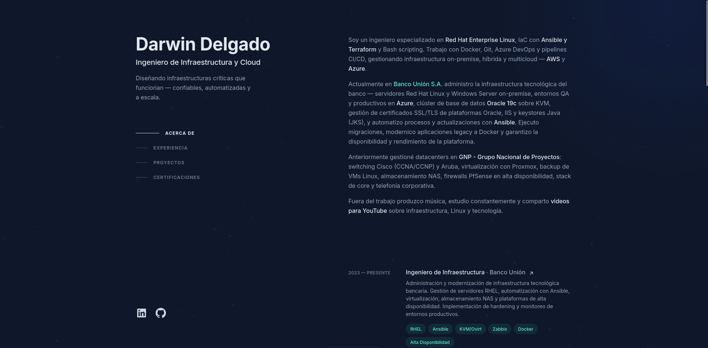

# Darwin Delgado — Portfolio V2

<div align="center">
  
</div>

<br />

Portafolio personal construido con Astro, Tailwind CSS y desplegado en Cloudflare Pages.

## Inicio rápido

### Instalación

```bash
pnpm install
```

### Desarrollo

```bash
pnpm dev
```

El sitio estará disponible en `http://localhost:4321`

## Scripts disponibles

| Comando | Acción |
| :--- | :--- |
| `pnpm install` | Instala dependencias |
| `pnpm dev` | Servidor de desarrollo en `localhost:4321` |
| `pnpm build` | Genera el sitio en `./dist/` |
| `pnpm preview` | Vista previa del build en local |

## Personalización

Edita los archivos en `src/data/` para actualizar el contenido:

- **`me.json`** — Información personal y contacto
- **`experience.json`** — Experiencia laboral
- **`projects.json`** — Proyectos
- **`certifications.json`** — Certificaciones
- **`links.json`** — Redes sociales

## Blog

Cada post es un archivo `.md` en `src/content/blog/`. No hay editor ni panel — se escribe en el editor que quieras y se sube al repo.

### Cómo escribir un post nuevo

1. Crea un archivo en `src/content/blog/nombre-del-post.md` (el nombre del archivo es la URL: `/blog/nombre-del-post`).
2. Arriba va el frontmatter, abajo el contenido en Markdown:

   ```markdown
   ---
   title: "Título del post"
   date: 2026-06-20
   description: "Una línea resumiendo el post."
   category: "AWS"
   ---

   Contenido del post en Markdown normal: párrafos, `## subtítulos`,
   listas con `-`, código con \`backticks\`, etc.
   ```

3. `category` agrupa el post en el listado de `/blog` (ej. "AWS", "Certificaciones", "Linux"). Usa la misma categoría tal cual en varios posts para que se agrupen juntos.

### ¿Con copiar el .md y hacer push ya funciona?

Sí. No necesitas correr `pnpm build` en tu máquina ni nada más:

```bash
git add src/content/blog/nombre-del-post.md
git commit -m "Nuevo post: nombre del post"
git push
```

Cloudflare Pages está conectado al repo de GitHub — cuando detecta el push a `main`, corre `pnpm build` automáticamente en su lado y despliega el resultado. El post aparece en el sitio unos minutos después del push, sin que tengas que tocar nada más.

## Despliegue en Cloudflare Pages

1. Sube el proyecto a GitHub
2. Ve a [Cloudflare Dashboard](https://dash.cloudflare.com) → Workers & Pages → Create → Pages
3. Conecta el repositorio de GitHub
4. Configura el build:
   - **Framework**: Astro
   - **Build command**: `pnpm build`
   - **Output directory**: `dist`
5. Deploy

## Contacto

- **LinkedIn**: [dwsdelgado](https://linkedin.com/in/dwsdelgado)
- **GitHub**: [@dwsdelgado](https://github.com/dwsdelgado)
